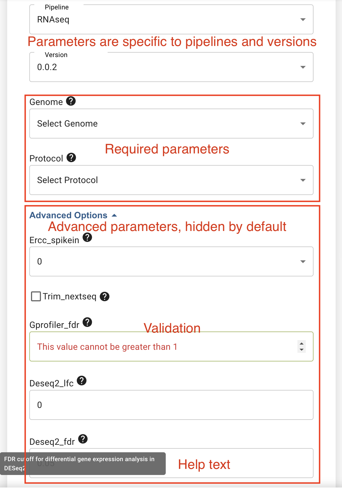
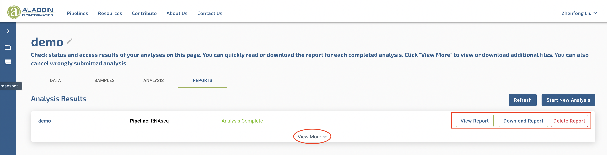
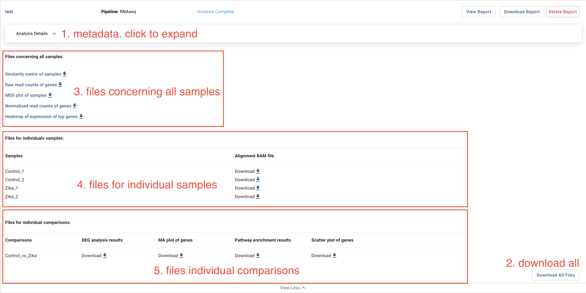

# Pipeline requirements
This document details the requirements of Nextflow pipelines in order for it to run Aladdin platform.

## Table of contents
* [Table of contents](#table-of-contents)
* [Overview of Aladdin platform](#overview-of-aladdin-platform)
  * [Upload FASTQ](#upload-fastq)
  * [Choose sample type](#choose-sample-type)
  * [Start new analysis](#start-new-analysis)
    * [Choose input parameters](#choose-input-parameters)
    * [Choose samples and group comparisons](#choose-samples-and-group-comparisons)
  * [View results](#view-results)
* [Pipeline requirements](#pipeline-requirements)
  * [Basic requirements](#basic-requirements)
    * [Nextflow pipeline in a repository](#nextflow-pipeline-in-a-repository)
  * [Input requirements](#input-requirements)
    * [Pipeline schema](#pipeline-schema)
    * [Design CSV file](#design-csv-file)
  * [Output requirements](#output-requirements)

## Overview of Aladdin platform
We will go over the main functionality and pages of Aladdin platform to familiarize you with its designs so that you have a context on why some of the pipeline requirements exist and how some of the required components of the pipeline interacts with user interface (UI). While there are other functionalities on Aladdin platform such as user management, project management and educational contents, the main bioinformatics functionalities are carried out in 4 steps and 4 pages: upload data, choose sample type, start new analysis, and view results.

### Upload FASTQ
Users always begin a project on Aladdin by uploading their FASTQ files on a page like this. 


The section on the left side is where users can upload their FASTQ files and monitor upload progress. Only `.fastq.gz` and `fq.gz` files are accepted. The section on the right side displays uploaded and unpaired FASTQ files. Users can pair read 1 and read 2 files, and change short names of FASTQ file pairs in this section. Automatic pairing of FASTQ files is carried out for recognized file naming patterns, namely [Illumina FASTQ naming convention](https://support.illumina.com/help/BaseSpace_OLH_009008/Content/Source/Informatics/BS/NamingConvention_FASTQ-files-swBS.htm) or the simple pattern of "name_R1.fastq.gz; name_R2.fastq.gz". Users can drag and drop R1/R2 files to correct file pairings. After uploading and pairing FASTQ files, users click "Next" and will be asked to confirm the FASTQ file pairings.

### Choose sample type
On the second page, users will be asked to choose one of recognized sample types. The purpose of sample types are to check compatibility with bioinformatic pipelines. Most bioinformatics pipelines can only be used on data from certain library types. For example, it makes no sense analyzing RNAseq data with a methylseq pipeline. Users can also change sample names or delete samples on this page. Users cannot advance to other pages until all samples have their types chosen.


### Star new analysis
On the third page, users can start a new bioinformatics analysis. The section on the left is used to define metadata of this analysis such as name and description, choose a pipeline, and define input parameters for the selected pipeline in this analysis. The section on the right is used to select samples to be included in this analysis.


#### Choose input parameters
Once users choose a pipeline, various form items will displayed on the UI for the user to define input parameters. Depends on the types of the input parameter, an appropriate form item such as drop-down selection, textbox, checkbox will be displayed. There are two groups of parameters: required parameters and advanced parameters. Required parameters are always displayed and a valid choice/value in each of them is required from the users. Advanced parameters are hidden unless users click to expose them. Advanced parameters must have a default value. Parameters have a question mark next to them to display a help text when moused over. The UI will also carry out validation of input parameters.



#### Choose samples and group comparisons
After choosing pipeline and its parameters, users can choose samples to add to this analysis. Only samples whose types are compatible with the selected pipeline are displayed. Users can also add group labels to enable comparisons between groups, for example, disease vs. control. We realize that group comparisons may not be applicable to every analysis. In the next update, we will add a checkbox to skip group comparisons.


After users click "Add Selected Samples to Analysis" button, there will be confirmation page of what the users have chosen/entered. User then click "Run Analysis" to submit this analysis.


### View results
On the 4th and last page, users can check status of ongoing analyses and view results of finished analyses. Each analysis in the project will be represented with a card. Cards of completed analyses have two buttons to view and download their reports. The "report" here refers to a single HTML report that the pipeline has produced for this analysis. These cards can also be expanded by clicking the "View More" button.



The expanded analysis results cards has several sections:
1. Metadata of analysis such as description texts, samples chosen, group labels, etc.
2. A button to download all results files.
3. Files concerning all samples. This section contains a list of descriptions and download links of files/plots related to all samples in the anlaysis. For example, similarity matrix, PCA, MDS plots of all samples.
4. Files for individual samples. This section contains a table with samples in rows and file types in columns. Each cell in the table contains the name and download link of a file. Pipelines can use this section to deliver files such as BAM file to the users.
5. Files for individual comparisons. This section contains a table with comparisons in rows and file types in columns. Each cell in the table contains the name and download link of a file. Pipelines can use this section to deliver files such as differential gene expression comparison results, pathway enrichment analysis results to the users.
**Sections 3,4,5 will only appear if there are files in that section.**



## Pipeline requirements
Now that you are familiar with how UI works on Aladdin platform, we will go over the requirements for pipelines to run on Aladdin. With the context of the UI, you will see why some of the requirements exist and how the required files interact with the UI.

### Basic requirements

#### Nextflow pipeline in a repository
Aladdin only accepts pipelines written in [Nextflow](https://www.nextflow.io/). You can read [Nextflow documentation](https://www.nextflow.io/docs/latest/index.html#) to quickly learn the basics of Nextflow. Your Nextflow code will be run with the latest stable release of Nextflow, so all features in the Nextflow documentation should be supported, though we have not tested every one of them. While we recommend writing Nextflow code with its DSL 2 because improvements in modularity and readability, pipeline written with DSL 1 should also work.<br>

Your Nextflow pipeline must be stored in a GitHub/GitLab [^1] repo. Pipelines in public repos will automatically work. For ones in private repos, please work with us on granting access. You can see an example pipeline that runs on Aladdin [here](https://github.com/Zymo-Research/aladdin-rnaseq).

[^1]: According to Nextflow documentation, both Github and GitLab repos are supported, but we have only tested Github repos.

We recommend [nf-core](https://nf-co.re/) pipelines and think you can learn a lot on Nextflow best practices by reading nf-core pipelines. We also recommend [nf-core tools](https://github.com/nf-core/tools) to help you create and write your pipelines.

#### AWS Batch requirements
Pipelines are run on AWS Batch using r5-2xlarge instances by default. If your pipeline requires more resources than that, we can make it work, but you must inform us. Translating these into Nextflow, your pipeline must:
1. have a `awsbatch` profile. You can include [this config file](https://github.com/Zymo-Research/aladdin-rnaseq/blob/main/conf/awsbatch.config) in your repo, and import this config file in your `nextflow.config` file. Assuming your `awsbatch` config file is stored at `conf/awsbatch.config`, add the following code in your `nextflow.config`.
    ```
    profiles {
        awsbatch { includeConfig 'conf/awsbatch.config' }
    }
    ```
2. have Docker container(s) for all your processes. For example, you can use a single container for all your processes by adding the following code in your `nextflow.config`.
    ```
    process.container = 'zymoresearch/aladdin-rnaseq:1.0.0'
    ```
    Or, you can define container(s) for specific processes by using the [`container` directive](https://www.nextflow.io/docs/latest/process.html#container). We have tested and recommend using public images in [docker hub](https://hub.docker.com/). If you must using private Docker images, please work with us to set them up.
3. not exceed maximum available resources (8 cpus and 64G memory by default) when requesting compute resources. If one of your processes request more cpu/memory than available in the instance type, the process and the pipeline will stuck. Because it is common to request compute resources dynamically in Nextflow pipelines, such as in [this config file](https://github.com/Zymo-Research/aladdin-rnaseq/blob/main/conf/base.config), it is best practice to set max cpu/memory and use a function to make sure requested cpu/memory do not exceed those max values. You can refer to [this config file](https://github.com/Zymo-Research/aladdin-rnaseq/blob/main/nextflow.config) on how to do that.

### Input requirements

#### Pipeline schema
As you can see [above](#choose-input-parameters), Aladdin UI displays a form for the users to define input parameters of selected pipeline and validates those input values. To do that, Aladdin needs to know what are the available and expected paramters for your pipeline. This is achieved by providing a pipeline schema file. You can use [nf-core tools](https://github.com/nf-core/tools) to help you create a schema file. Aladdin expects your repo to have a `nextflow_schema.json` file under the root directory. The schema file should be written according to [JSONSchema specification](https://json-schema.org/) draft 7. You can find an example of such schema file [here](https://github.com/Zymo-Research/aladdin-rnaseq/blob/main/nextflow_schema.json).<br><br>
Attributes of each parameters such as `type`, `enum`, `maximum`, `minimum` will be used to display appropriate forms on the UI and validate input values. The `description` attribute will be used to display a help text for each parameter. After users submit an analysis, Aladdin will use the chosen values to construct a Nextflow command, for each parameter "parameter_name" with "parameter_value", `--parameter_name parameter_value` will be added to the Nextflow command.<br><br>
In addition to all keywords supported by JSONSchema draft 7, Aladdin recognizes a few others:
1. **hidden**: accepts boolean values only, default false. This is used to signal that this parameter should not appear on Aladdin UI. This is useful for parameters such as output directory, work directory that are not configurable when a pipeline is run on Aladdin. You can also choose to delete these parameters from the pipeline schema. However, we also recognize you may want your pipeline schema to be complete and comprehensive for running the pipeline with other tools or in other compute environments. Therefore, you can add `"hidden":true` to parameters that you don't want to appear in the UI in those cases.
2. **advanced**: accepts boolean values only, default false. This is used to signal that this parameter should be in the advanced parameter section. When `"advanced":true` is stated, the parameter must have default value. This is useful when a parater should not be changed by most users but should still be available to more advanced users.
> The following keywords are experimental and could be changed!
3. **choices_json**: accepts a URL. Aladdin expects the URL points to a public available JSON file. Aladdin will read all the keys and the values of `description` of each key, unless `"hidden":true` is specified. The descriptions will be displayed on the UI as choices. Aladdin will use the key of the chosen option instead of the displayed description as the input value of that parameter. You can see an example of such JSON file [here](https://github.com/Zymo-Research/pipeline-resources/blob/main/genomes/rnaseq.json). The main reason for this feature is the following. Bioinformatics pipelines often uses various resources such as genomes and annotations. We prefer separating the definitions of these files from the pipeline source code to make version control of pipelines easier. Because resource definitions are outside of the pipeline codebase, and because the available choices are not defined using the `enum` keyword in the schema file, there is no need to version bump the pipeline every time resource definitions are updated. This also works for different library prep kits and various trimming options associated with that, see example [here](https://github.com/Zymo-Research/pipeline-resources/blob/main/protocols/rnaseq.json).

#### Design CSV file
After users submit an analysis, Aladdin creates a design CSV file with the following the format:
```
group,sample,read_1,read_2
Control,Sample1,s3://mybucket/this_is_s1_R1.fastq.gz,s3://mybucket/this_is_s1_R2.fastq.gz
Control,Sample2,s3://mybucket/this_is_s2_R1.fastq.gz,s3://mybucket/this_is_s2_R2.fastq.gz
Experiment,Sample3,s3://mybucket/that_is_s3_R1.fastq.gz,
Experiment,Sample4,s3://mybucket/that_be_s4_R1.fastq.gz,
```
The `group` column contains the group labels the users chose, or empty strings when users elect to skip group comparisons. The `sample` column contains sample labels the users chose. The `read_1` and `read_2` columns contain S3 locations of the FASTQ files, or empty strings for `read_2` if applicable.<br>
This file is then fed to the pipeline with `--design <path to design CSV file>`. Your pipeline should have code to parse this file and create channels for FASTQ files. You can find an example of such code [here](../examples/parse_design.nf).
> Additional columns may be supported in a future version.

### Output requirements
As you can see [above](#view-results), Aladdin generally has 5 different sections when displaying the outputs of an aanlysis, with 2 of them being mandatory. Therefore, all pipelines on Aladdin must produce a **single** report file for each analysis. We recommend a self-inclusive HTML file, meaning all plots are encoded in the HTML file itself, PDF files should also work as well. Please note that HTML files that rely on other files will not work. If you would like to generate a report for each sample, they could be displayed in section 4 of the Results page, but a report file for the analysis is still required. Your pipeline must report the types and locations of output files via a JSON output manifest file to Aladdin. Aladdin expects such a file at `${params.outdir}/download_data/files_to_download.json`. You can find an example of the manifest file [here](../examples/files_to_download.json).<br>
In the manifest JSON file, each entry should be one file that you want to expose to the users, with file names used as keys. Recognized attributes/keywords for each entry are:
1. **path**: S3 path of the file. This is required for all files.
2. **scope**: which section of the Results page this file should appear in. Accepeted values are `report`, `all_samples`, `samples` and `comparisons`, for sections 1,3,4,5 on the Results page, respectively. This is required for all files.
3. **file_type**: explains what this file is. Vallues will be displayed as list items in section 3, or column names in section 4 and 5.
4. **sample**: only applicable for files in section 4. Values will displayed as row names.
5. **comparison**: only applicable for files in section 5. Values will displayed as row names.
6. **md5sum**: md5sum of the file. This is currently not used, but may be used in a furture version to assist user in verifying complete and correct downloads.

There is no generic way to produce this manifest file because pipelines have vastly different output files. One reasonable way to do this in Nextflow is to create a channel collecting the paths of all output files, and parse these paths to create a manifest file based on file names/prefixes/suffixes. You can read about how we do it in our [example pipeline](https://github.com/Zymo-Research/aladdin-rnaseq), or specifically [this excerpt](https://github.com/Zymo-Research/aladdin-rnaseq/blob/ad857939c9dadfb5e794d251e204ac761c30cf4b/workflows/rnaseq.nf#L278-L302), [this process](https://github.com/Zymo-Research/aladdin-rnaseq/blob/main/processes/summarize_downloads.nf) and [this python script](https://github.com/Zymo-Research/aladdin-rnaseq/blob/main/bin/summarize_downloads.py).
